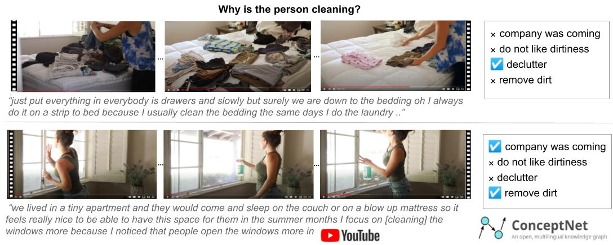

WhyAct: Identifying Action Reasons in Lifestyle Vlogs
=================================================================================
Oana Ignat, Santiago Castro, Hanwen Miao, Weiji Li and Rada Mihalcea

Language and Information Technologies (LIT), University of Michigan

This repository contains the dataset and code for our EMNLP 2021 paper:

[WhyAct: Identifying Action Reasons in Lifestyle Vlogs](TODO) (the PDF will be posted soon)

## Task Description


Automatic  identification of action reasons in online videos. 
The reasons for *cleaning* change based on the visual and textual (video transcript) context. 
The videos are selected from YouTube, and the actions together with their reasons are obtained
from the ConceptNet (Speer et al., 2017) knowledge graph which we supplement with crowd sourced reasons.
The figure shows two examples from our WhyAct dataset

## Introduction

We aim to automatically identify human action reasons in online videos. 
We focus on the widespread genre of lifestyle vlogs, in which people perform actions while verbally describing them. 
We introduce and make publicly available the WhyAct dataset, consisting of 1,077 visual actions manually annotated with 
their reasons. We describe a multimodal model that leverages visual and textual information 
to automatically infer the reasons corresponding to an action presented in the video.

## Annotation Details

We select five YouTube channels and download all the videos and their transcripts. The channels are selected to have good quality videos with automatically generated transcripts containing detailed verbal descriptions of the actions depicted.

We also collect a set of human actions and their reasons from ConceptNet (Speer2017ConceptNet5A). Actions include verbs such as: *clean*, *write*, *eat*, and other verbs describing everyday activities. 
The actions are selected based on how many reasons are provided in ConceptNet and how likely they are to appear in our collected videos.

The resulting (video clip, action, reasons) tuples are annotated with the help of Amazon Mechanical Turk (AMT) workers. They are asked to identify: (1) what are the reasons shown or mentioned in the video clip for performing a given action; (2) how are the reasons  identified in the video: are they mentioned verbally, shown visually, or both; (3) whether there are other reasons other than the ones provided; (4) how confident the annotator is in their response.

The following table shows statistics for our final dataset of video-clips and actions annotated with their reasons.


Video-clips | Video hours | Transcript words | Actions | Reasons |
------------ | ------------- | ------------- | ------------- | -------------
1,077 | 107.3 | 109,711 | 24 | 166 |

For our experiments, we split the data across video-clips: 20% development and 80% test

## Data Format

Other than this README file, the archive contains the data release in the following files:

+ [`dev.json`](Data/dev.json) 
+ [`test.json`](Data/test.json) 

```js
{
    "action": [
      {
        "sentence_before": "",
        "sentence": "",
        "sentence_after": "",
        "time_s": "",
        "time_e": "",
        "video": "",
        "verb_pos_sentence": "",
        "answers": [
          "",
          // ...
        ],
        "reasons": [
          "",
          "",
          // ...
        ]
      },
      // ...
    ],
  // ...
}

```

+ `"action"` represents the verb (eat, drink, etc.).
+ `"sentence"` represents the transcript sentence that contains the verb.
+ `"sentence_before"` and `"sentence_after"` represent the before and after sentences.
+ `"time_s"` and `"time_e"` represent the start time and end time of the clip in the video.
+ `"video"` represents the YouTube video address.
+ `"verb_pos_sentence"` represents the start position of the verb in `"sentence"`.
+ `"answers"` represent the list of annotated reasons (the ones labeled by the majority)
+ `"reasons"` represent the list of all candidate reasons.

## Experiments
+ Run baselines from [`baselines`](baselines) 
+ Run multi-modal model from [`multimodal`](multimodal)

## Citation information
If you use this dataset or any ideas based on the associated research article, please cite the following:

```bibtex
@inproceedings{,
    title="",
    author={},
    booktitle="",
    month="",
    year=""
}
```

## Acknowledgements

We thank Pingxuan Huang for helping us with improving the annotation user interface.
